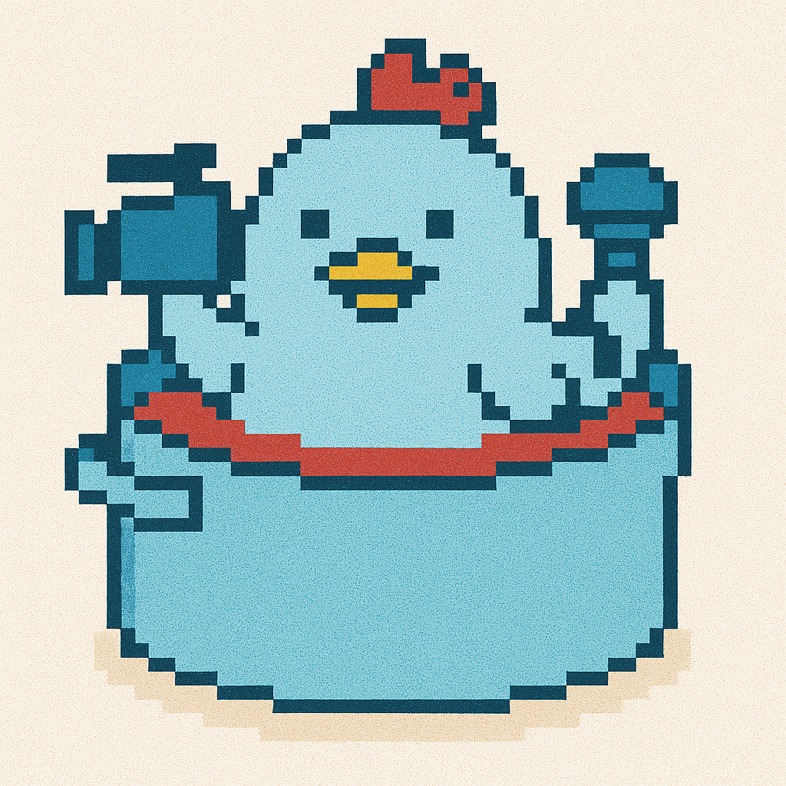

# node-red-contrib-triggerable-browser-utils

[日本語版はこちら (Japanese version)](README.ja.md)

[Node-RED](http://nodered.org) nodes for browser functionality such as file upload, camera, and microphone  
**with support for triggering from Inject nodes and function nodes, not just the node-side button**.



---

## About this project

This repository is a fork of [node-red-contrib-browser-utils](https://github.com/node-red-contrib-utils/node-red-contrib-browser-utils).  
In addition to the original "button-only trigger" design, this version allows **camera, microphone, and file upload nodes to be triggered from Inject nodes, Function nodes, or any upstream node in your flow**.

---

## Install

Run the following command in the root directory of your Node-RED install:

```sh
npm install node-red-contrib-triggerable-browser-utils
```

Or using Node-RED's Palette Manager:

1. Go to the Node-RED menu
2. Select "Manage palette"
3. Click the "Install" tab
4. Search for "triggerable-browser-utils"
5. Click install

---

## Usage

### Triggerable Camera (`trig camera`)

The camera node allows you to capture images from a connected camera or webcam.

**Features:**
- Trigger image capture from inject nodes or the node's button
- Select specific camera device when multiple cameras are available
- Choose output format: Buffer or Base64 string
- Set interval for continuous captures
- Supports Chrome and Firefox browsers

**Properties:**
- **Name**: Customize the node name
- **Interval (ms)**: Set delay between captures for continuous mode (default: 2000ms)
- **Camera**: Select which camera device to use
- **Output Format**: Choose between Buffer (default) or Base64 string

**Outputs:**
- `msg.payload`: The captured image in PNG format (as Buffer or Base64 string)
- `msg.content_type`: 'image/png'
- `msg.format`: 'buffer' or 'base64'
- `msg.timestamp`: Capture timestamp

**Control via message:**
```javascript
// Basic trigger
msg.payload = {}; // Simple trigger

// With specific command
msg.payload = { command: "capture" }; // Take a single picture
msg.payload = { command: "start" }; // Start camera
msg.payload = { command: "stop" }; // Stop camera
msg.payload = { command: "loop", interval: 5000 }; // Continuous capture every 5 seconds
```

---

### Triggerable Microphone (`trig microphone`)

The microphone node enables audio recording from a connected microphone.

**Features:**
- Start/stop recording via inject nodes or the node's button
- Toggle behavior: first trigger starts recording, second trigger stops
- Select specific microphone device when multiple are available
- Supports Chrome and Firefox browsers (HTTPS required)

**Properties:**
- **Name**: Customize the node name
- **Microphone**: Select which microphone device to use

**Outputs:**
- `msg.payload`: The recorded audio in WAV format (Buffer)
- `msg.content_type`: 'audio/wav'
- `msg.timestamp`: Recording timestamp

**Control via message:**
```javascript
// Toggle recording (start/stop)
msg.payload = {}; // Simple trigger toggles recording state

// With specific command
msg.payload = { command: "start" }; // Start recording
msg.payload = { command: "stop" }; // Stop recording and output WAV
```

---

### Triggerable File Inject (`trig file inject`)

The file inject node allows uploading files from the browser to your flow.

**Features:**
- Two operation modes:
  1. Pre-configured file: Upload and store a file in the node's configuration
  2. On-demand selection: Trigger a file selection dialog when activated
- Trigger file sending via inject nodes or the node's button

**Properties:**
- **Name**: Customize the node name
- **File**: Select and upload a file to store in the node (when in pre-configured mode)

**Outputs:**
- `msg.payload`: The file data (Buffer)
- `msg.filename`: Original filename
- `msg.mimetype`: MIME type of the file

**Control via message:**
```javascript
// Simple trigger to send the pre-configured file
msg.payload = {}; // Sends the configured file

// Using stored file allows automated workflows without manual file selection
```

---

## Browser Compatibility and Requirements

- **HTTPS Required**: Camera and microphone access require a secure context (HTTPS)
- **Supported Browsers**: Chrome, Firefox, and other modern browsers
- **Permissions**: Users must grant permission to access camera and microphone
- **Dashboard Usage**: Works great with Node-RED dashboard, allowing user media interaction

---

## Technical Details

### Camera Node

- Uses `navigator.mediaDevices.getUserMedia()` for camera access
- Captures images by drawing video frames to a canvas element
- Converts to PNG format using canvas.toBlob()
- Images are sent back to Node-RED via HTTP POST

### Microphone Node

- Uses Web Audio API for recording
- Records audio in WAV format
- Maximum recording time is limited by browser memory

### File Inject Node

- Uses standard HTML5 file input for file selection
- Pre-configured files are stored in Base64 format

---

## Tips for Use

1. **Use with Dashboard**: These nodes work well in dashboard environments for interactive applications

2. **Error Handling**: Always add error handling since browser permissions might be denied

3. **Multiple Instances**: You can have multiple instances of each node targeting different devices

4. **Security**: Remember that all browser interactions require user permission

5. **Chain Processing**: Connect to image/audio processing nodes for advanced applications

---

## Main differences from the original

- **Triggering from flows:** All nodes can now be triggered by Inject, Function, or other nodes, not just the node-side button
- **Device selection:** Added ability to select specific camera and microphone devices
- **Output formats:** Camera node supports both Buffer and Base64 output
- **Pre-configured files:** File inject node can store files for automated workflows

---

## Contributing & License

Pull requests and bug reports are welcome.  
This project is licensed under the [Apache 2.0 license](https://www.apache.org/licenses/LICENSE-2.0).

This repository is based on work by IBM Corp. in [node-red-contrib-browser-utils](https://github.com/node-red-contrib-utils/node-red-contrib-browser-utils),  
with modifications and enhancements by Nobisuke Sugawara.

---